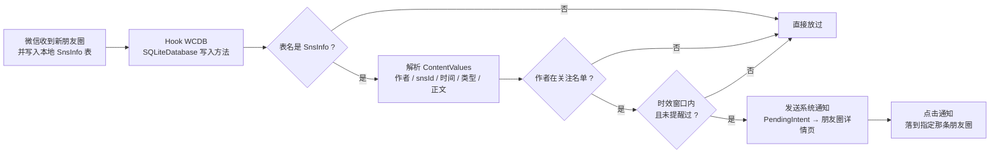

<div align="center">

# 朋友圈关注提醒 · MomentWatch

基于微信 LSPosed 模块 [WAuxiliary](https://github.com/HdShare/WAuxiliary_Public) 的插件：
**给指定好友设置关注名单，他们一发新朋友圈就推送通知，点通知直接跳到那条朋友圈。**

[](https://github.com/mcxiaochenn/WAuxiliary-MomentWatch-Plugin/stargazers)
[](https://github.com/mcxiaochenn/WAuxiliary-MomentWatch-Plugin/network/members)
[](https://github.com/mcxiaochenn/WAuxiliary-MomentWatch-Plugin/issues)
[](LICENSE)
[](#兼容性)
[](#兼容性)

</div>

---

## 功能

- **关注名单**：从好友列表里多选要关注的人，支持关键字筛选，支持全选 / 反选（仅作用于当前筛选结果）。
- **新动态提醒**：名单内的人发布新朋友圈时推送系统通知，通知正文带上动态类型与文字摘要。
- **点击直达**：点通知直接打开**那条**朋友圈的详情页，而不是朋友圈首页。
- **不打扰**：同一 `snsId` 只提醒一次；早于本次监视起点的历史动态、超出时效窗口的补收动态都不会弹通知。
- **可暂停**：设置里一个开关就能暂停提醒，不用卸载插件。

不做的事：不自动点赞、不自动评论、不改写你的朋友圈，只做「看 + 提醒 + 跳转」。

## 工作流程



朋友圈数据落在 `SnsMicroMsg.db` 的 `SnsInfo` 表。微信把一条新动态写进本地库时，
必然要经过腾讯自研 WCDB 的 `SQLiteDatabase.insert / insertWithOnConflict / replace / update`，
插件就 Hook 这几个方法，从写入参数里拿到「谁、哪条、什么时候、什么类型」。
这条路径依赖的是**方法名与表名这两个跨版本稳定的字符串**，不依赖混淆后的类名，
也不依赖反射微信内部的 obfuscated 类。细节见 [docs/04-detection-and-jump.md](docs/04-detection-and-jump.md)。

## 兼容性

| 项目 | 说明 |
|---|---|
| 宿主模块 | [WAuxiliary](https://github.com/HdShare/WAuxiliary_Public)（`me.hd.wauxv`），插件目录版本 `v127` |
| 微信版本 | 跟随 WAuxiliary 的适配区间（官方声明 `8.0.44 ~ 8.0.65`，国内版与 Google Play 版） |
| 系统 | Android 8.0+（通知渠道需要 API 26+；`PendingIntent.FLAG_IMMUTABLE` 需要 API 23+） |
| 运行环境 | LSPosed / LSPatch 等 Xposed 框架，作用域为 `com.tencent.mm` |
| 已实测 | WAuxiliary `1.2.7.r1499` + 微信 `cn.8.0.78.3180` + LSPosed `2.2.0-it` |

> WAuxiliary 通过 DexKit 兼容混淆版本，但**朋友圈详情页的类名与 Intent 键名是硬编码的字符串**。
> 涉及跳转的部分属于版本敏感项，已在 [docs/06-test-plan.md](docs/06-test-plan.md) 里列为必测项。

> 本插件全程只使用 WA 公开接口，**不引用 `de.robv.android.xposed.*` 下的任何类型** ——
> WA 默认开启「Xposed API 调用保护」，脚本里命名 `XC_MethodHook` 这类类型会导致插件加载失败。
> Hook 走 WA 内置的 `hookAfter` / `unhook`，回调参数用反射读取。

## 安装

### 方式一：作为独立插件安装

1. 下载插件目录 [`plugins/v127/mcxiaochen/MomentWatch/`](plugins/v127/mcxiaochen/MomentWatch)
   （保持目录结构与文件名大小写不变）。
2. 把整个 `MomentWatch` 目录放进 WAuxiliary 的插件目录，或使用 WA 的插件导入入口。
3. 在 WAuxiliary 里重新加载插件（或重启微信）。

### 方式二：合入官方插件仓库

本仓库遵循 [`HdShare/WAuxiliary_Plugin`](https://github.com/HdShare/WAuxiliary_Plugin) 的目录约定
`plugins/<版本>/<作者>/<插件>/`，可直接作为 PR 提交到上游。

### 开发环境安装（免打包）

```bash
git clone https://github.com/mcxiaochenn/WAuxiliary-MomentWatch-Plugin.git
# 把 plugins/v127/mcxiaochen/MomentWatch 放进 WA 插件目录即可
```

## 使用

插件提供两个入口，任选其一：

- WAuxiliary 的插件列表 → 本插件的「设置」；
- 微信内触发 `openSettings`（WA 插件的标准设置入口）。

设置界面：

| 项 | 说明 |
|---|---|
| 关注名单 | 点开好友多选，勾选要关注的人。名单以 `wxid` 存储，仅保存在本机 |
| 启用提醒 | 总开关。关闭后 Hook 仍在，但不会产生任何通知 |
| 提醒时效 | 只提醒该时间窗内发布的动态，可选 6 小时 / 24 小时 / 3 天 / 不限 |
| 发送测试通知 | 立刻发一条测试通知，用来验证通知权限、通知渠道与点击跳转是否正常 |
| 清空已提醒记录 | 清空去重账本，让动态可以重新提醒（一般用于排障） |

## 配置项

配置保存在插件目录下的 `config.prop`，由 WAuxiliary 的配置接口读写。

| 键 | 类型 | 默认值 | 说明 |
|---|---|---|---|
| `mw_enable` | boolean | `true` | 总开关 |
| `mw_watch_list` | String | `""` | 关注名单，逗号分隔的 `wxid` |
| `mw_max_age_sec` | long | `86400` | 提醒时效窗口（秒），`0` 表示不限 |
| `mw_seen_ids` | String | `""` | 已提醒过的 `snsId` 账本（内部维护，上限 500 条，按写入顺序淘汰） |

详细的读写时机、并发与淘汰策略见 [docs/05-config-and-storage.md](docs/05-config-and-storage.md)。

## 代码结构

```
plugins/v127/mcxiaochen/MomentWatch/
├── info.prop          插件元信息（name / author / version / updateTime）
├── main.java          入口：模块加载顺序、WA 回调转发
├── readme.md          插件说明（宿主内展示）
└── src/
    ├── Util.java      通用工具：文本清洗、集合解析、时间格式化、主线程提示
    ├── Config.java    配置与运行状态：读写 config.prop、去重账本、时效
    ├── Jumper.java    跳转 Intent 组装与三级降级
    ├── Notifier.java  通知构建与发送（渠道、文案、PendingIntent）
    ├── SnsHook.java   Hook 注册/卸载、ContentValues 解析、命中判定
    ├── SettingsUi.java 设置界面（代码构建，不依赖宿主资源）
    └── Service.java   生命周期入口（onLoad / onUnload / openSettings）
```

模块加载顺序为 `Util → Config → Jumper → Notifier → SnsHook → SettingsUi → Service`，
模块只能调用已加载的模块。完整的模块划分、职责边界与内部接口定义见
[docs/01-architecture.md](docs/01-architecture.md) 与 [docs/03-interfaces.md](docs/03-interfaces.md)。

## 文档

| 文档 | 内容 |
|---|---|
| [docs/01-architecture.md](docs/01-architecture.md) | 整体架构、分层依据、模块划分与依赖规则 |
| [docs/02-code-structure.md](docs/02-code-structure.md) | 逐文件的职责、关键函数清单与数据流 |
| [docs/03-interfaces.md](docs/03-interfaces.md) | 用到的 WA 接口清单、内部模块接口、数据结构定义 |
| [docs/04-detection-and-jump.md](docs/04-detection-and-jump.md) | 新动态检测方案与点击跳转方案（含版本兼容与降级策略） |
| [docs/05-config-and-storage.md](docs/05-config-and-storage.md) | 配置项、存储格式、并发与淘汰策略 |
| [docs/06-test-plan.md](docs/06-test-plan.md) | 已验证项、真机必测项与验收标准 |

## 开发与验证

改动插件后可直接跑本地验证（不需要真机）：

```bash
bash tools/verify/run.sh
```

它会用真实的 BeanShell 解析器逐文件做语法校验，再用桩类在 JVM 上执行核心逻辑的 67 项断言
（命中判定、去重、时效、参数解析、跳转组装、Hook 生命周期）。
覆盖边界说明见 [tools/verify/README.md](tools/verify/README.md)。

## 已知限制

- **时效依赖微信自身的同步**：插件在「新动态写入本地库」这个时刻捕获事件。若微信长时间未同步
  （例如长期断网或进程未驻留），动态会在下次同步时才被捕获，此时若已超出你设置的时效窗口就不会提醒。
- **跳转目标页的类名是版本敏感项**：`SnsCommentDetailUI` 等类名在不同微信版本上可能变化。
  插件已内置三级降级（详情页 → 作者朋友圈 → 朋友圈首页），最坏情况下仍能落到朋友圈。
- **首次打开朋友圈不会刷屏**：早于本次插件加载时刻的动态一律视为历史数据，不提醒；
  插件每次加载都会重置这个监视起点。
- **同一时间大量新动态**会连续发多条通知，插件不做聚合。

## 交付状态

本仓库按「先文档、后运行代码」的节奏交付：

| 部分 | 状态 |
|---|---|
| README / LICENSE / 规划文档（`docs/`）/ 验证工具链（`tools/`） | ✅ 已推送 |
| 插件实际运行部分（`plugins/v127/mcxiaochen/MomentWatch/`） | ⏳ 已完成实现与本地验证，**待真机测试通过后再推送** |

因此当前 `plugins/` 目录在远端为空，`.gitignore` 里有一条对应规则把它排在提交之外。
真机验证通过后，删掉 `.gitignore` 中的这一节即可正常提交插件运行代码：

```gitignore
/plugins/v127/mcxiaochen/MomentWatch/
```

## 免责声明

- 本项目仅用于学习与技术研究，**请勿用于任何非法用途**。
- 一切因使用本插件造成的后果（包括但不限于账号风险、数据异常、设备问题）由使用者自行承担。
- 如果本插件被大量用于非法用途，作者会移除相关功能或停止维护。

## 许可证

[MIT](LICENSE) © 2026 辰渊尘 (ChenDusk)
